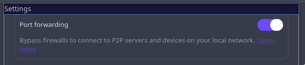
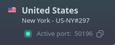
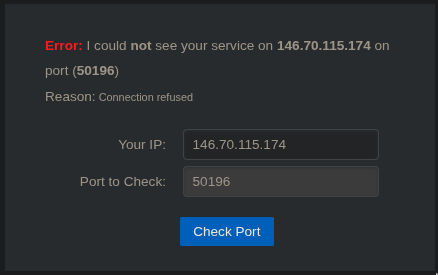
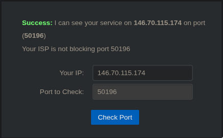
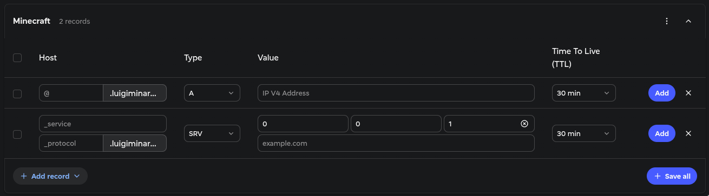
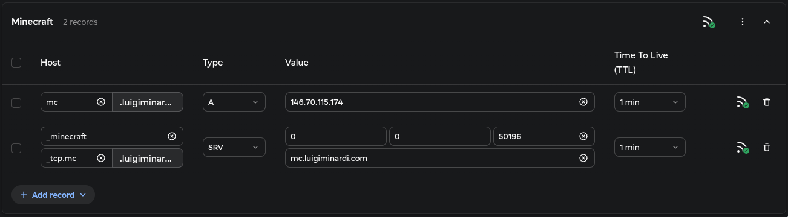
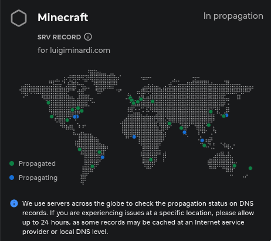
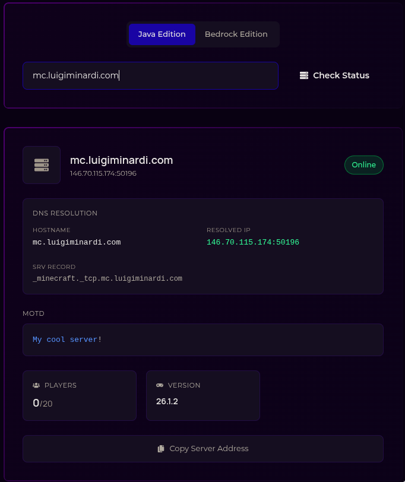
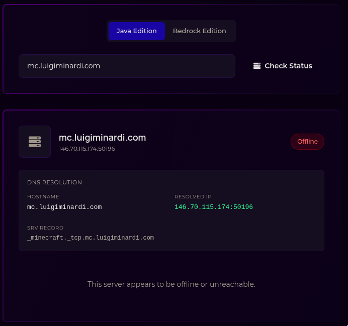

+++
draft = true
title="How to self-host minecraft safely with port forwarding"
description="How to self host a minecraft server using proton vpn and fabric."
summary="Setting up a minecraft server without exposing your machine to the internet by port forwarding."
date="2026-06-18"
tags=["minecraft", "fabric", "proton vpn", "dns"]
categories=["any", "tutorial", "games"]
+++

This is a tutorial that will teach how to host a modded minecraft server with
Fabric on your own machine (you can use a VPS too but then port forwarding is
not needed), then using Proton VPN (or any VPN that allows port forwarding) to
expose your server on the interent safely and linking it to a domain you own so
that you can have a cool URL for your friends to connect to instead of them
needing to switch the IP/port every time you restart your PC (because of the
VPN).

I'm a linux user and thus I'll show how to do it on linux through a terminal
(most of the time). All things I'm showing can be installed and configured with
GUIs, I will not show how but it's supposedly easier than through a terminal
(if you're not familiar with one).

## What you need

For the modded minecraft server
- [Java](https://adoptium.net/temurin/releases/)
- [Fabric](https://wiki.fabricmc.net/player:tutorials:install_server)

For the port forwarding
- A paid VPN that allows port forwading (I'll show [Proton](https://protonvpn.com),
use one that you trust)

For the custom domain
- A domain from a registrar that allows you to edit DNS records of type `A` and `SRV` (most do).

For the server configuration
- A text editor
> I will show the "cool way" with [tmux](https://github.com/tmux/tmux/wiki/Installing),
> [tmuxinator](https://github.com/tmuxinator/tmuxinator#installation) and
> [neovim](https://neovim.io/doc/install/), but you can use what you're
> confortable with.

### Installing Java

I recommend managing `Java` versions via [Mise](https://mise.jdx.dev/installing-mise.html)
if you're not good with CLI's you can use [Mise Versions](https://mise-versions.jdx.dev)
to browse the package you want to install via Mise.
> Docs about how mise handle Java [here](https://mise.jdx.dev/lang/java.html#java)
> (linking for information, you should not need to look at this for this tutorial)

Install [Java](https://jdk.java.net/archive/) at version
`25.0.2` or the latest current LTS version.
```sh
mise use -g java@25.0.2
```
There are a lot of Java providers [as seen here](https://whichjdk.com/#releases)
and in the [Mise Versions java page](https://mise-versions.jdx.dev/tools/java)
since this is for a minecraft server and not for long term development that
needs continuous maintenance I recommend installing `openjdk` at the latest
`LTS`. If your idea is to have a server running for **years** and being activelly
maintened you might prefer `temurin` or whatever is the current recommendation
for **development**.

To check if the installation worked run
```sh
java --version
```
should show something similar to
```
openjdk 25 2025-09-16
OpenJDK Runtime Environment (build 25+35-3488)
OpenJDK 64-Bit Server VM (build 25+35-3488, mixed mode, sharing)
```

### Installing Fabric

Before doing so create and enter the directory where you want your server to be.

I have my directory structure like this:
```
.minecraft_servers
├── server1
└── server2
```

In my case to make `server1` a Fabric server I need to install fabric at
`~/.minecraft_servers/server1/`

so `cd ~/.minecraft_servers/server1/` to be inside the server directory.

Then go to [fabricmc.net/use/server](https://fabricmc.net/use/server/) and get
the `curl` command to download the fabric `.jar` which currently has this structure
> DO NOT RUN THIS COMMAND AS IT WILL NOT WORK, THIS IS HERE AS AN EXAMPLE
```sh
curl -OJ https://meta.fabricmc.net/v2/versions/loader/<minecraft_version>/<fabric_loader_version>/<fabric_installer_version>/server/jar
```
So for minecraft 26.1.2 with fabric 0.19.3 and installer version 1.1.1 you should
run this command.
```
curl -OJ https://meta.fabricmc.net/v2/versions/loader/26.1.2/0.19.3/1.1.1/server/jar
```

You should always install the latest fabric version when possible, then tell
your players the exact version of minecraft and fabric you're using. In the
example it would be minecraft `26.1.2` and fabric `0.19.3`.

## Starting a server

With java and fabric installed you can already run a server, on the same
directory you downloaded fabric, agree to Minecraft eula by creating an
`eula.txt` file with `eula=true` written in it
```sh
echo "eula=true" > eula.txt
```
then start the server:
> This will create the files and directories needed in a minecraft server and
run your server in your local IP with the settings declared at `server.properties`
```sh
java -Xms1G -Xmx4G -jar fabric-server-mc.26.1.2-loader.0.19.3-launcher.1.1.1.jar nogui
```
`-Xms1G` means that the minimum memory for the server will always be 1 Gigabyte  
`-Xmx4G` means that the maximum memory for the server will be 4 Gigabyte  
`-jar fabric..jar` is telling java to run the server using the fabric loader  
`nogui` is so that java dont start a graphical interface to show you the server
logs (it will show in the terminal instead)

You can have less minimum memory or more maximum memory if your machine has
more RAM available and you will need to play with those numbers to find the
sweet spot for your server depending on how many mods and players (at the same
time) you have.

## VPN Config

Enable port forwarding on your VPN settings


> On Proton VPN servers that have port forwarding enabled will show this arrow
> icon


Connect to your VPN and you should se a number in your interface indicating the
port they assigned to you


After connecting to the VPN find your IP with this
```sh
curl https://api.ipify.org
```
The current IP for Proton US-NY#297 is `146.70.115.174`, this is your VPN IP,
if you dont have a custom domain that IP will be the one you share with your
friends.

IP's are not static so in a few months this IP might change since ISPs (and VPN
providers) shift IP blocks every now and then for many reasons. It is not
something that happens often so you can save the server you connected to (in my
case `US-NY#297` and always connect to it, that way you only need to change the
port when you reconnect to your VPN instead of needing to change both port and
IP.
> Some VPNs provide a service of a static port that you can have yourself, if
> you want to have a server for years this might be a good thing to look into
> to reduce the rassle. The better thing in this case would probably have a VPS
> or a static IP from your ISP and do a port forward on your router, even
> better if you can have a separated network for your on-prem server and your
> house for safety since that would be opening a real port on your machine.

## Minecraft server config

Now get your VPN port in my case `50196` and go to your `server.properties`,
there you will find a `server-port=25565`, change that to match your VPN port.

```properties
server-port=50196
```

If you server was open go to the terminal that it was and type `/stop` to stop
gracefully, else start your server.

Now on your minecraft if you go to `localhost:50196` you should be able to join
your server, and to check if it's publicly working you can go to
[canyouseeme.org](https://www.canyouseeme.org) and type your port and IP there.

If you don't have the server open or did something wrong this is what is shown:


If you are connected to the VPN with port forwarding enabled, edited your server
properties to the correct port and restarted your server this is what you should
see


## Custom domain DNS config

Now go to where you bought your custom domain (your registrar) and go to the DNS
configuration page of your domain. Then you need to **add two records**, an `A`
and a `SRV` one.


### A (Address) record

On the `A` record `Host` you will put a subdomain that you want your server to
be in like `mc` for `mc.luigiminardi.com` to be my server.

On the `Value` you put your VPN IP address (`146.70.115.174` in my case).

The `TTL` should be set to 1 minute so that DNS propagation happens fast.

> If you have a static IP and port you might prefer to use a higher TTL as
> explained [here](https://gcore.com/learning/what-is-dns-ttl).

### SRV (Service) record
As you can see in the image my registrar SRV `Host` fields only shows the
`_service` and the `_protocol` fields, some registrars also have a `_name` field
after the protocol one.

Set your `_service` as `_minecraft`.

If you have a `_name` field set it the same as the subdomain on the `A` record
and set your `_protocol` to `_tcp`.

If you only have a `_protocol` you will do `_protocol.subdomain` as your field
and match the subdomain of your `A` record in it. So my `_protocol` will be
`_tcp.mc` since I need to match the `mc` of my `A` record.

On the `Value` you can see `0`, `0`, `1` then `example.com`, that is the
`priority`, `weight`, `port` and `target` respectively.

If the only thing you have on your domain is the minecraft server `priority` and
`weight` can be maintained as `0`.

> Lower priority numbers are tried first, weight is for load balance between
> servers with the same priority, so if you have a huge server you can set 100
> in your expensive VPS and 10 in your cheap one and the expesive VPS would get
> 10x more traffic making the cheap one as a fallback.

The `port` is the port your VPN provided you (in my case `50196`).

The `target` is your `A` record `Host` field (complete), so in my case
`mc.luigiminardi.com`.



Some registrars show you the propagation state, you need to wait for it to
fully propagate for your server to work.


> More detailed explanations on SRV [here](https://stw.no/en/tutorials/dns/srv-records/)

After your server has fully propagated you can check if its working
[here](https://gbnodes.host/tools/server-status)



With this you're done and you can share your server with your friends (in my
case `mc.luigiminardi.com`)

If you shut the server down it should show as this


### IMPORTANT
Every time you shut down your computer OR your VPN/switch VPN servers you **need**
to update your `A record` and your `SRV record` to match the new IP and port and
your `server.properties` to match the new port. Then wait the DNS to propagate
again and your server will be back to up and running.

If you configured your custom domain your players don't need to do anything, if
you're sharing your VPN IP and port with them then you need to share the new IP
and port for the server every time.

On your own machine since you access your port directly via `localhost` or a
local IP you will need to edit the `port` or your server in your minecraft
launcher to match the new port, else you wont be able to join your world.

## The extra mile

Now I will show how I did my `tmuxinator` config for easy turning the server on
and off and also showing players that the server is going to shut down.

I also recommend installing the [just enough backups](https://modrinth.com/mod/justenoughbackups-jeb)
mod in your server so that you can have backups automatically done every X time.

### Tmuxinator

Make sure you have [tmux](https://github.com/tmux/tmux/wiki/Installing),
[tmuxinator](https://github.com/tmuxinator/tmuxinator#installation),
[ruby](https://mise-versions.jdx.dev/tools/ruby) and
[neovim](https://neovim.io/doc/install/) installed.

Create a new tmuxinator session
```sh
tmuxinator new minecraft
```

Copy my configuration into it, remember to change the `server` `panes` `java`
command to the same you use to launch your server and the `root` to the path
to your server files.

If you use `bat` you can replace `tail` on the `on_project_stop` with
`bat /tmp/minecraft-pane.log -r -30:`.
```yaml
# ~/.config/tmuxinator/minecraft.yml

name: minecraft
root: ~/.minecraft_servers/server1/

# Run on project stop
on_project_stop: |
  tmux send-keys -t minecraft:2.1 'title @a title {"text": "Server Shutting Down","color":"red"}' Enter;
  tmux send-keys -t minecraft:2.1 'title @a subtitle {"text": "gracefully with tmuxinator","color":"aqua"}' Enter;
  sleep 5;
  tmux send-keys -t minecraft:2.1 "/stop" Enter;
  sleep 2;
  tmux capture-pane -t minecraft:2.1 -S -100 -p > /tmp/minecraft-pane.log;
  tail /tmp/minecraft-pane.log -n 30

# Specifies (by name or index) which window will be selected on project startup. If not set, the first window is used.
startup_window: server

# Controls whether the tmux session should be attached to automatically. Defaults to true.
attach: false

windows:
  - editor:
      layout: main-vertical
      panes:
        - nvim server.properties
  - server:
      layout: main-vertical
      panes:
        - java -Xms1G -Xmx4G -jar fabric-server-mc.26.1.2-loader.0.19.3-launcher.1.1.1.jar nogui
```

This config starts `tmux` in `detached` mode when you run the
[start](#starting-the-server) command and tells your players that the server is
shutting down and also logs the shutdown for you and display the last 30 lines
of the log for you to make sure everything worked propperly after running the
[stop](#stopping-the-server) command.

#### starting the server
```sh
tmuxinator start minecraft
```
#### stopping the server
```sh
tmuxinator stop minecraft
```
#### attaching tmux
```sh
tmux attach -t minecraft
```
##### **Switching to nvim to edit the server.properties**
inside the attached tmux do `Ctrl + b` then `1` or `0` depending on the number
that shows before your `editor` window.

then on nvim you can edit the file however you see fit.

#### detaching tmux
`Ctrl + b` then press `d`

> [tmux cheatsheet](https://tmuxcheatsheet.com) for beginners

### Just Enough Backups (JEB)

On `config/justenoughbackups.json` this is my JEB config
```json
{
  "backupMode": "FULL",
  "automaticBackupsEnabled": true,
  "pauseAutomaticBackupsWithoutPlayers": true,
  "backupOnServerStart": false,
  "backupOnServerStop": false,
  "automaticIntervalMinutes": 60,
  "automaticBackupWarningEnabled": true,
  "automaticBackupWarningMinutes": 5,
  "commandPermissionLevel": 2,
  "messageChannel": "ACTION_BAR",
  "integrityMode": "STRICT",
  "includeSummaryFile": false,
  "minimumFreeSpaceReserveMb": 512,
  "retention": {
    "full": 5,
    "incremental": 20,
    "differential": 10,
    "maxTotalSizeMb": 0
  },
  "popup": {
    "enabled": true,
    "showTitle": true,
    "centerText": true,
    "showBorder": true,
    "x": 8,
    "y": 8,
    "xRatio": -1.0,
    "yRatio": -1.0,
    "backgroundColor": "0xAA101010",
    "runningColor": "0xFF55FFFF",
    "completedColor": "0xFF55FF55",
    "failedColor": "0xFFFF5555",
    "textColor": "0xFFE0E0E0",
    "title": "Just Enough Backups",
    "runningText": "Running {reason} {type}",
    "completedText": "Completed {reason} {type}",
    "failedText": "Unable to Backup"
  },
  "backupDirectory": "backups/"
}
```
